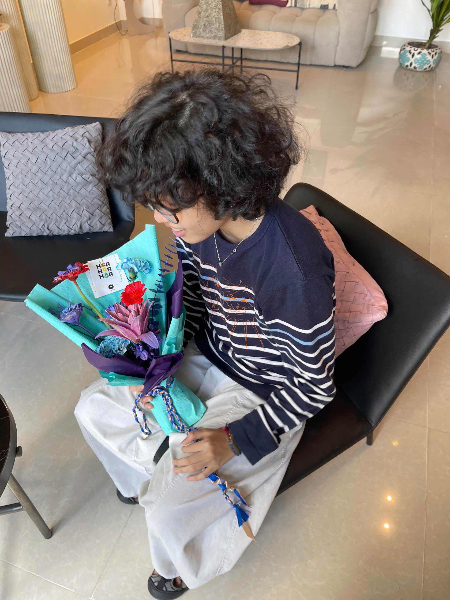

<table style="border:none;">
  <tr style="border:none;">
    <td width="25%" align="center">
      
    </td>
    <td width="75%"  style="border:none;">
<h1 style="color:#e63946">Welcome to my profile</h1>
      
### 👩‍🎓 Thông tin cá nhân  
- 🎓 Sinh viên năm 3 ngành **Công nghệ Đa phương tiện**  
- 🏫 Học viện Công nghệ Bưu chính Viễn thông (PTIT), TP. Hồ Chí Minh  
- 📊 GPA trung bình 4 kỳ gần nhất: **>3.3 (Loại giỏi)**  
  </td>
  </tr>
</table>
---

## 📬 Liên hệ  
  
  
  

---

## 📚 Học vấn  
- Hiện đang theo học chuyên ngành **Công nghệ Đa phương tiện tại PTIT**  
- 📊 GPA trung bình 4 kỳ gần nhất: **>3.3 (Loại giỏi)**  

---
## Dự án đã thực hiện  

- MV Ngắn - Say You Do (2025)  
  - Vai trò: Quay dựng, dựng phim cho môn học Dựng phim  
  - Công cụ: Premiere Pro, After Effects  

- Website Bán Sách (2024)  
  - Website cá nhân bán sách, có phân loại theo chủ đề, lọc theo giá  
  - Công cụ: HTML, CSS, JavaScript, VS Code  

- Poster & Thiết kế ấn phẩm (2024)  
  - Các poster truyền thông cho sự kiện sinh viên  
  - Công cụ: Photoshop, Illustrator  

## 🛠️ Công cụ thành thạo  

  
  
  
  
  
  
  

---

## ⭐ Kỹ năng  

| Kỹ năng              | Đánh giá |
|----------------------|----------|
| 🌍 Tiếng Anh         | ⭐⭐⭐☆☆ |
| 💻 Tin học văn phòng | ⭐⭐⭐☆☆ |
| 🤝 Làm việc nhóm     | ⭐⭐⭐⭐☆ |
| ⚡ Xử lí tình huống   | ⭐⭐⭐⭐☆ |
| 🔥 Chịu đựng áp lực  | ⭐⭐⭐☆☆ |

---

## 📊 Biểu đồ GPA  

